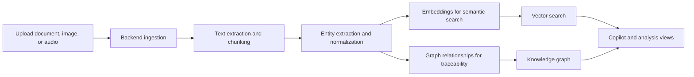

# GyanVriksh - Tree of Knowledge

AI-powered industrial knowledge intelligence platform built for ET AI Hackathon 2026, Problem Statement 8.

GyanVriksh turns scattered industrial documents, maintenance records, regulations, and expert voice notes into a searchable knowledge system. It is designed for plants and asset-heavy operations where information is spread across PDFs, SOPs, work orders, incident logs, and tribal knowledge that is usually trapped in people’s heads.

## At a glance

| Area | What it covers |
|------|----------------|
| Problem | Knowledge is locked across documents and people, while experienced engineers are retiring with critical know-how. |
| Solution | A living knowledge operating system that ingests documents, builds relationships, and answers questions with evidence. |
| Users | Maintenance engineers, plant managers, technicians, compliance auditors, admins, and field users. |
| Core outputs | Searchable knowledge, citations, graph relationships, compliance insights, maintenance intelligence, and preserved expert knowledge. |

## Why this exists

Every large industrial plant accumulates thousands of documents that collectively hold decades of operational intelligence: engineering drawings, maintenance work orders, SOPs, safety procedures, inspection records, regulatory submissions, and incident reports.

That knowledge exists, but it is locked. Teams spend time searching for information that already exists, and the broader knowledge cliff means experienced engineers and operators are retiring with hard-earned judgment that is rarely captured anywhere.

GyanVriksh is the answer to both problems. It is not a chatbot over PDFs. It is a living knowledge operating system that understands industrial entities, connects them across documents, preserves spoken expertise, and delivers the right information at the right moment.

## What the project does

- Ingests documents, images, and audio into a processing pipeline.
- Extracts text, entities, and relationships from industrial content.
- Stores knowledge in a graph database and vector database for hybrid search.
- Powers an AI copilot that answers questions with citations and context.
- Supports compliance checks, maintenance intelligence, lessons learned, and knowledge preservation.
- Includes a mobile-friendly field interface and an admin dashboard.

## Core capabilities

- **Document intelligence**: parse PDFs, scanned files, images, spreadsheets, and structured logs.
- **Industrial knowledge graph**: connect equipment, work orders, incidents, procedures, people, and regulations.
- **Ask Copilot**: query the system in natural language and get grounded answers.
- **Compliance intelligence**: surface missing or risky gaps in documents and operating practice.
- **Maintenance intelligence**: correlate failures, repeat issues, and root-cause patterns.
- **Knowledge preservation**: capture expert voice notes and convert them into searchable knowledge.
- **Lessons learned**: extract recurring failure patterns from incident history.
- **Mobile field mode**: quick access for technicians on the plant floor.

## How it works



1. A file or recording is uploaded through the frontend.
2. The backend stores it, extracts text, chunks the content, and runs entity extraction.
3. Embeddings are created for semantic search and graph relationships are written for traceability.
4. The frontend uses those indexes to power chat, document views, graph exploration, compliance views, and preservation workflows.

## System overview

| Layer | Main pieces |
|------|-------------|
| Backend | FastAPI, Celery, Kafka, Redis, PostgreSQL, Neo4j, Qdrant, MinIO |
| Frontend | React 18, TypeScript, Vite, Tailwind CSS, Zustand |
| AI / ML | GPT-4o or Ollama fallback, Whisper, BGE-M3 embeddings, industrial NER model |
| Infra | Docker, Docker Compose, Nginx |

## Included apps

- Dashboard
- Ask Copilot
- Documents
- Knowledge Graph Explorer
- Knowledge Cliff
- Equipment QR
- Compliance
- Maintenance
- Preservation Studio
- Lessons Learned
- Admin
- Mobile Field mode

## Local run

From the `gyanvriksh` folder:

```powershell
copy backend\.env.example backend\.env
.\start-infra.bat
.\setup-backend.bat
.\start-backend.bat
.\start-frontend.bat
```

Open http://localhost:5173 and log in with one of the demo users below.

## Demo users

| Role | Email | Password |
|------|-------|----------|
| Maintenance Engineer | engineer@bharatchem.in | gyanvriksh |
| Plant Manager | manager@bharatchem.in | gyanvriksh |
| Field Technician | tech@bharatchem.in | gyanvriksh |
| Compliance Auditor | auditor@bharatchem.in | gyanvriksh |
| Admin | admin@bharatchem.in | gyanvriksh |

## Project docs

- `HOW_TO_RUN.md` has the demo-oriented startup guide.
- `SECURITY.md` covers the security posture for the demo build.

## Demo data note

The repository uses a synthetic Bharat Chemicals dataset for the demo. It is not connected to a real plant.

## Public repo note

The public repository intentionally keeps source, setup docs, and demo data. Pitch collateral, demo-script assets, QA screenshots, and other non-essential marketing files are excluded.
